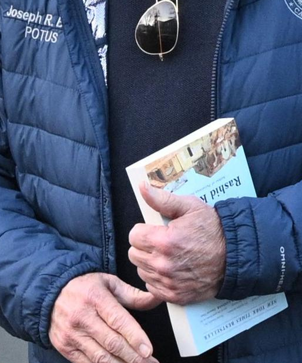

[2lbpamphlet.com](http://2lbpamphlet.com)

# Help Us Win 2028!! 

The 2023 Gaza "Catastrophe" is History's greatest gift to a political enemy of The Democrats!

Please exit this page if you are a *Friend Of The Democrats*. 

 

### The State of Israel = No Successor Democrat POTUS !

Our theory is simple ... As long as the State of Israel exists, America's Dems cannot re-capture POTUS. Help us make this dream come true!

<!-- <table><tr><td>

</td>
<td > Donate Now 
   <a href="0xD63B25cfB1b05bbF5e694Aca571eE096cE235C3B">eUSDT Address</a> 

(full list below)
</td></tr></table> -->

__________________

### The Base Voter

Our focus is the **African-American Base Voter** — specifically in Pennsylvania.  (Then eventually other swing states.) 

No demographic determines the direction of the Country as does the Democrat Base of Black Voters — especially the choice of President of U.S.

We need your help to maximize disengagement of this influential demographic group! 

 

#### Vote Suppression vs. Voter DISCRETION

On Election Day, Nov.5, 2024, **bomb threats via email** were sent to locations in 32 Pennsylvania counties — mainly polling places, election offices, and other government buildings.  This is a blunt form of **vote suppression**. 

Now you don't support emailed bomb threats; we certainly don't. 

But ... what if there was a magic neutron bomb specifically for urban Democrat votes?  Can you imagine?  What if some idea could produce natural, legal, permanent voter suppression — such that some Democrats, quietly and voluntarily, simply Did. Not. Vote.  (At least for POTUS.)  

Could there be an Idea powerful enough? 

#### The History of *Palestine* 

Writing about Israeli-Palestinian history, famous Black Intellectuals have—
 
 * compared **anti-Black racism** in the U.S. to Palestinian subjugation, calling both "linked struggles"

 * warned that Israel risked becoming a **state of "racial exclusivism"** if it did not address Palestinian rights

 * declared "the solution [to the conflict] must be found in a world where **no group dominates** another."

When the Base Voter contemplates the decades of history of the Palestinian people — their imagination is not with Israel or the Jews.  No, the **identification and sympathy** are with the Arabs.  The Black voter's lived experience resonates with the past and present of all Palestinian people.

But the History of Palestinian suffering is also the History of **U.S. Support for Israel**.

 

#### Responsibility for Policy 

*Election Day 2028*.  Take an imaginary Base Voter in Pittsburgh.  He wants to vote for Mayor of the city.  Additionally he has the opportunity to vote for President of the U.S.  

Casting a vote for Mayor is relatively simple — he knows all the issues. 

However, for our Base Voter, voting for POTUS is also choosing the Commander in Chief.  Because Israel policy (internal & external) is equivalent to U.S. foreign policy — voting for Commander in Chief means endorsing (implicitly) the current and future actions of U.S./Israel with respect to the Palestinian condition and the Arab neighbor states. 

 

Ta-Nehisi Coates is a modern-day Black intellectual and writer. 
He visited Israel/Palestine in summer 2023. 

In his book *The Message*, Coates writes: "I don't think I ever, in my life, felt the glare of racism burn stranger and **more intense than in Israel**." This book "lays forth the case that the Israeli occupation is a moral crime, one that has been all but **covered up by the West**." 

Coates then said, upsetting the New York Media establishment — If apartheid is wrong **then it is always wrong**, in every situation.  (Coates swiftly became persona non grata in mainstream media after speaking his truth.)

Imagine it is now 2028 and the Dems have nominated a staunch ally & defender of Israel.  Having publicly stood against apartheid, Ta-Nehisi Coates must choose between voting for a pro-Israel candidate ... or, what?  The decision is difficult, conflicted, and painful.  Maybe he simply doesn't vote (for POTUS at least)?

Nothing is more distressing and demoralizing for the Base Voter than making a choice for Commander in Chief and U.S. Foreign Policy.  (Even if Palestine is bad for the Grand Old Party, it is *much worse* for The Democrats!)  

#### Genocide Joe

The Biden Administration's support for Israel after Oct.2023 is a **kind of betrayal** of the Dem Base.  A horrific, gut-wrenching betrayal. 

Today, the Democratic Party is no longer credible as **Champions & Defenders**!  ... unless that means Champions of Israel and Defenders of Zionism.

Help Us **Disaffect & Disengage** the Swing State Democratic Base! 

__________________________

#### Last Democrat POTUS Holding an Emblem of Party's Collapse 

 

____________________________________

### Method 
<!-- https://x.com/khamenei_ir/status/1921138072516784283  
Peoples minds must not ..-->

The Base Voter must always be mindful of the Palestinian situation -- present day and the history.  We employ **True Propaganda** to realize this.
 
You are familiar with knockoff Gucci bags.  A Chinese handbag, physically identical to an "official" Gucci product — but not sanctioned. 

For this project, we print and distribute thousands of **knockoff paperback books** — physical reproductions of well-known and popular history books.  The two main titles for distribution are (1) [*Ethnic Cleansing of Palestine*](http://amazon.com/dp/1851685553); and (2) [*100 Years' War on Palestine*](http://amazon.com/dp/1250787653).  

These books are a **permanent, cross-generational** history lesson (true propaganda). 

For delivery of books, we enlist the support of **Couriers**.  Each Courier lives in a densely African-American area of Pennsylvania — Pittsburgh, Philly, Harrisburg, Chester, Wilkinsburg, etc.  

The couriers deliver stacks of books to their neighbors (storefronts, residences, nursing homes, and so on). 

The couriers film themselves making each delivery.  Brief edits of the videos are published to provide **proof of the operation**.  (Stay tuned...!)

Our method is Simple. Powerful. **Effective**. 
<!-- last thing on Earth hillary & nancy etc. want to hear about ; proselytizing , spread , info -->

## 2028 Is Closer Than It Seems ! 

Can you pitch in so we can avoid a *2028 Dem POTUS*??!  Every dollar adds up.  

The easiest way to help, of course, is just share this page.

<!-- 
### getsession.org Contact = 
05f773a69fff897b3b1fb69229a3d788822546339320fd1ddbcfb9fdf12efb740b
-->
<!-- 
### 
One Day, Everyone Will Have Always Been Against This (El Akkad), amazon.com/dp/0593804147 -->

### Donate crypto $$

| coin  |  |
|----------|----------|
| tether usdt (eth)     | 0xD63B25cfB1b05bbF5e694Aca571eE096cE235C3B |
| circle usdc (eth)     | 0xD63B25cfB1b05bbF5e694Aca571eE096cE235C3B  |
| dai (makerdao)   | 0xD63B25cfB1b05bbF5e694Aca571eE096cE235C3B  |
| ethereum     | 0xD63B25cfB1b05bbF5e694Aca571eE096cE235C3B |
| trx usdt (Tron)     | TK5azi6RyQtpS9QrQREFeg795JauoX2c3Z  |
| sol usdt (Solana)     | w2voyw1Zh4VkiB5uCJxFjX9LhqNimu5RyP8AFmWYUge |
| litecoin     | ltc1q9ve9lc6y2jxnhn5zuur4n2qlzv9g6mlmxah58k |
| bitcoin     | bc1q88tgp3khaqeagk6n64vkjv3aad2vhus7tcu9e0   |

xmr (Monero)   \
42RBd4ptiuD2MttZG2W4ChaxVFKqHHa42eR6Z7V99GS742EYmNwYRYkdXamvYguK6P6UbsAvDbk3XJWSzdbgkM2dJDS5A96 

<!--  -->

---------------------------

[2lbpamphlet.com](http://2lbpamphlet.com)
